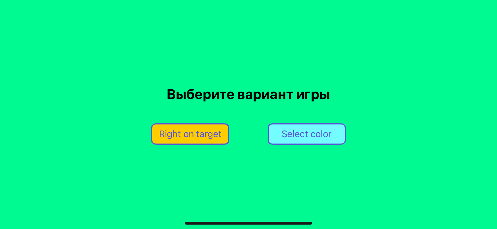
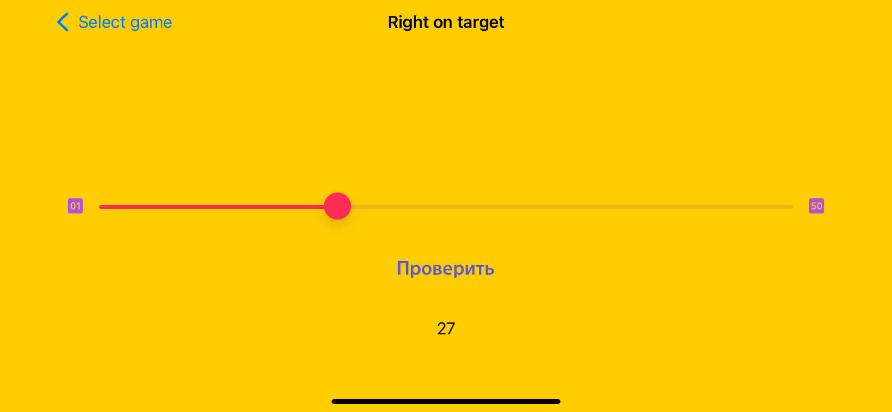
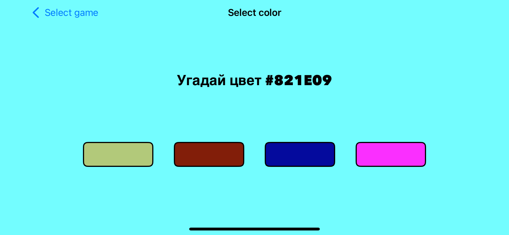

## Right on target

 

</a>
</a>

## About the project

##### This is my first project. A gaming app, with two games. The first game is a "right on target" game. In it, the user has to guess a random number from 1 to 50. The second game is "Select color". The user is given a hexadecimal color code and chooses the appropriate color from 4 options. 

| Main screen | Right on target | Select color |
| --- | --- | --- |
||| 
